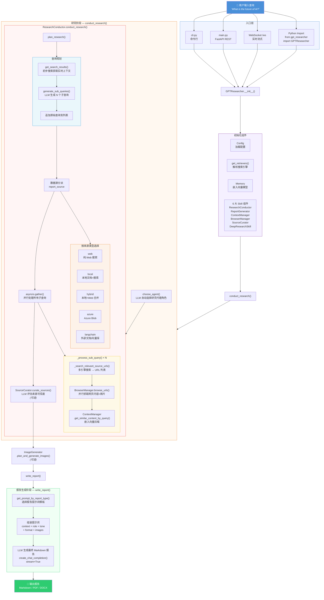

# GPT Researcher 架构图

## 1. 核心调用流程图

> 以一次完整的 `research_report` + `web` 研究为例，展示从用户输入到报告输出的完整调用链。

```mermaid
flowchart TD
    User["👤 用户输入查询<br/><i>'What is the future of AI?'</i>"]

    subgraph Entry["入口层"]
        CLI["cli.py<br/>命令行"]
        API["main.py<br/>FastAPI REST"]
        WS["WebSocket /ws<br/>实时流式"]
        PKG["Python Import<br/>from gpt_researcher<br/>import GPTResearcher"]
    end

    User --> CLI & API & WS & PKG

    INIT["GPTResearcher.__init__()"]
    CLI & API & WS & PKG --> INIT

    subgraph InitBlock["初始化组件"]
        direction LR
        CFG["Config<br/>加载配置"]
        RET["get_retrievers()<br/>解析搜索引擎"]
        MEM["Memory<br/>嵌入向量模型"]
        SKILLS["6 大 Skill 组件<br/>ResearchConductor<br/>ReportGenerator<br/>ContextManager<br/>BrowserManager<br/>SourceCurator<br/>DeepResearchSkill"]
    end
    INIT --> InitBlock

    CR["conduct_research()"]
    InitBlock --> CR

    subgraph ResearchPhase["研究阶段 — conduct_research()"]
        direction TB

        CA["choose_agent()<br/>LLM 自动选择研究代理角色"]

        subgraph Conductor["ResearchConductor.conduct_research()"]
            direction TB

            PR["plan_research()"]
            subgraph PlanDetail["查询规划"]
                direction TB
                GS["get_search_results()<br/>初步搜索获取实时上下文"]
                GSQ["generate_sub_queries()<br/>LLM 生成 N 个子查询"]
                APPEND["追加原始查询到列表"]
                GS --> GSQ --> APPEND
            end
            PR --> PlanDetail

            DS["数据源分派<br/>report_source"]
            subgraph DataSources["按来源类型选择"]
                direction LR
                WEB["web<br/>纯 Web 搜索"]
                LOCAL["local<br/>本地文档+搜索"]
                HYBRID["hybrid<br/>本地+Web 合并"]
                AZURE["azure<br/>Azure Blob"]
                LC["langchain<br/>外部文档/向量库"]
            end
            DS --> DataSources

            PARALLEL["asyncio.gather()<br/>并行处理所有子查询"]

            subgraph SubQuery["_process_sub_query() × N"]
                direction TB
                SEARCH["_search_relevant_source_urls()<br/>多引擎搜索 → URL 列表"]
                SCRAPE["BrowserManager.browse_urls()<br/>并行抓取网页内容+图片"]
                COMPRESS["ContextManager<br/>.get_similar_content_by_query()<br/>嵌入向量压缩"]
                SEARCH --> SCRAPE --> COMPRESS
            end
            PARALLEL --> SubQuery

            CURATE["SourceCurator.curate_sources()<br/>LLM 评估来源可信度<br/><i>(可选)</i>"]
        end

        CA --> Conductor
        PlanDetail --> DS --> PARALLEL --> CURATE
    end
    CR --> ResearchPhase

    IMG["ImageGenerator<br/>.plan_and_generate_images()<br/><i>(可选)</i>"]
    CURATE --> IMG

    WR["write_report()"]
    IMG --> WR

    subgraph ReportPhase["报告生成阶段 — write_report()"]
        direction TB
        SEL["get_prompt_by_report_type()<br/>选择报告提示词模板"]
        ASSEMBLE["组装提示词<br/>context + role + tone<br/>+ format + images"]
        LLM_GEN["LLM 生成最终 Markdown 报告<br/>create_chat_completion()<br/>stream=True"]
        SEL --> ASSEMBLE --> LLM_GEN
    end
    WR --> ReportPhase

    OUTPUT["📄 输出报告<br/>Markdown / PDF / DOCX"]
    ReportPhase --> OUTPUT

    style User fill:#4A90D9,color:#fff
    style OUTPUT fill:#2ECC71,color:#fff
    style Entry fill:#f0f4ff,stroke:#4A90D9
    style ResearchPhase fill:#fff8f0,stroke:#E67E22
    style ReportPhase fill:#f0fff4,stroke:#2ECC71
    style Conductor fill:#fff5f5,stroke:#E74C3C
    style SubQuery fill:#fef9e7,stroke:#F1C40F
    style InitBlock fill:#f5f0ff,stroke:#8E44AD
    style PlanDetail fill:#eaf7fb,stroke:#3498DB
    style DataSources fill:#fdf2e9,stroke:#E67E22
```

---

## 2. 整体逻辑架构图

> 展示项目分层结构、模块职责及模块间依赖关系。

```mermaid
flowchart TB
    subgraph Frontend["前端展示层"]
        direction LR
        NEXTJS["Next.js App<br/><i>TypeScript + Tailwind</i><br/>components / hooks / actions"]
        STATIC["Static Frontend<br/><i>HTML + CSS + JS</i><br/>轻量级替代方案"]
    end

    subgraph AppLayer["应用服务层"]
        direction LR

        subgraph BackendServer["backend/server/"]
            FASTAPI["FastAPI App<br/><i>app.py</i><br/>REST + WebSocket"]
            WSM["WebSocketManager<br/>连接管理+流式推送"]
        end

        subgraph ReportTypes["backend/report_type/"]
            BASIC["BasicReport<br/>基础报告"]
            DETAILED["DetailedReport<br/>详细报告<br/><i>多阶段分段生成</i>"]
            DEEP_RT["DeepResearch<br/>深度研究报告"]
        end

        subgraph MultiAgents["multi_agents/"]
            LANGGRAPH["LangGraph 编排"]
            AGENTS["8 Agent Team<br/>Chief Editor / Researcher<br/>Writer / Reviewer / ..."]
        end

        CHAT["chat/<br/>ChatAgentWithMemory"]
        CLI_E["cli.py<br/>命令行入口"]
    end

    subgraph Core["核心引擎 — gpt_researcher/"]

        AGENT["GPTResearcher<br/><i>agent.py — 主编排器</i>"]

        subgraph Skills["技能层 skills/"]
            direction LR
            RC["ResearchConductor<br/><i>researcher.py</i><br/>研究执行主引擎"]
            RG["ReportGenerator<br/><i>writer.py</i><br/>报告撰写"]
            CM["ContextManager<br/><i>context_manager.py</i><br/>上下文压缩"]
            BM["BrowserManager<br/><i>browser.py</i><br/>网页抓取"]
            SC["SourceCurator<br/><i>curator.py</i><br/>来源审核"]
            DR["DeepResearchSkill<br/><i>deep_research.py</i><br/>递归深度研究"]
        end

        subgraph Actions["操作层 actions/"]
            direction LR
            QP["query_processing<br/>查询规划+子查询生成"]
            RR["retriever<br/>检索器工厂"]
            WS_A["web_scraping<br/>网页抓取调度"]
            RG_A["report_generation<br/>报告生成函数"]
            AC["agent_creator<br/>代理角色选择"]
            MP["markdown_processing<br/>目录/引用/标题提取"]
        end

        subgraph Providers["提供者层"]
            direction LR

            subgraph Retrievers["retrievers/ — 16 种搜索源"]
                direction TB
                TAVILY["Tavily<br/><i>(默认)</i>"]
                GOOGLE["Google"]
                BING["Bing"]
                DDG["DuckDuckGo"]
                EXA["Exa"]
                ARXIV["Arxiv"]
                PUBMED["PubMed"]
                SCHOLAR["Semantic Scholar"]
                SERP["SerpAPI / Serper<br/>SearchAPI / Searx"]
                MCP_R["MCP Retriever"]
            end

            subgraph Scrapers["scraper/ — 9 种抓取器"]
                direction TB
                BS["BeautifulSoup"]
                BROWSER["Browser<br/><i>Selenium / Playwright</i>"]
                FIRE["Firecrawl"]
                PYMUPDF["PyMuPDF<br/><i>PDF 提取</i>"]
                TAVILY_E["Tavily Extract"]
                WBL["WebBaseLoader"]
            end

            subgraph LLMProviders["llm_provider/"]
                direction TB
                OPENAI["OpenAI<br/>GPT-4 / GPT-4o"]
                CLAUDE["Anthropic Claude"]
                OLLAMA["Ollama<br/><i>本地模型</i>"]
                LITELLM["LiteLLM<br/><i>30+ 提供者</i>"]
            end
        end

        subgraph DataLayer["数据层"]
            direction LR
            CTX["context/<br/>ContextCompressor<br/>VectorstoreCompressor<br/>WrittenContentCompressor"]
            DOC["document/<br/>DocumentLoader<br/>OnlineDocumentLoader<br/>AzureDocumentLoader"]
            MEMM["memory/<br/>Embeddings 管理"]
            VS["vector_store/<br/>向量数据库集成"]
        end

        subgraph Infra["基础设施"]
            direction LR
            CONFIG["config/<br/>Config 配置管理"]
            PROMPTS["prompts.py<br/>提示词模板族<br/><i>40+ KB</i>"]
            UTILS["utils/<br/>logger / costs<br/>rate_limiter / enum"]
            MCP_C["mcp/<br/>MCP 客户端"]
        end
    end

    subgraph External["外部服务"]
        direction LR
        SEARCH_API["搜索 API<br/>Tavily / Google / Bing / ..."]
        WEB["互联网网页"]
        LLM_API["LLM API<br/>OpenAI / Claude / ..."]
        EMBED_API["Embedding API"]
        LOCAL_DOC["本地文档<br/>PDF / DOCX / CSV"]
    end

    subgraph DevOps["开发运维"]
        direction LR
        DOCKER["Docker<br/>docker-compose.yml"]
        TERRAFORM["Terraform<br/>ECR / GitHub Actions"]
        EVALS["evals/<br/>幻觉检测 / SimpleQA"]
        TESTS["tests/"]
        DOCS["docs/<br/>Docusaurus 文档站"]
    end

    %% 前端 → 应用层
    NEXTJS -->|"WebSocket<br/>HTTP"| FASTAPI
    STATIC -->|"served by"| FASTAPI

    %% 应用层 → 核心
    FASTAPI --> WSM
    WSM --> BASIC & DETAILED & DEEP_RT
    BASIC --> AGENT
    DETAILED --> AGENT
    DEEP_RT --> AGENT
    CLI_E --> AGENT
    LANGGRAPH --> AGENTS --> AGENT
    CHAT --> AGENT

    %% 核心内部关系
    AGENT --> Skills
    AGENT --> CONFIG & PROMPTS

    RC --> QP & RR & WS_A
    RG --> RG_A
    CM --> CTX
    BM --> WS_A
    SC -->|"LLM 评估"| LLMProviders
    DR --> RC

    QP -->|"LLM 生成子查询"| LLMProviders
    AC -->|"LLM 选择角色"| LLMProviders
    RG_A -->|"LLM 生成报告"| LLMProviders

    RR --> Retrievers
    WS_A --> Scrapers
    CTX --> MEMM
    MEMM --> EMBED_API

    %% 核心 → 外部
    Retrievers --> SEARCH_API
    Scrapers --> WEB
    LLMProviders --> LLM_API
    DOC --> LOCAL_DOC
    MCP_C --> MCP_R

    style Frontend fill:#EBF5FB,stroke:#3498DB
    style AppLayer fill:#F5EEF8,stroke:#8E44AD
    style Core fill:#FEF9E7,stroke:#F39C12
    style Skills fill:#FDEDEC,stroke:#E74C3C
    style Actions fill:#FDF2E9,stroke:#E67E22
    style Providers fill:#E8F8F5,stroke:#1ABC9C
    style DataLayer fill:#F4ECF7,stroke:#9B59B6
    style Infra fill:#F2F3F4,stroke:#7F8C8D
    style External fill:#D5F5E3,stroke:#27AE60
    style DevOps fill:#EAECEE,stroke:#566573
    style Retrievers fill:#E8F8F5,stroke:#1ABC9C
    style Scrapers fill:#E8F8F5,stroke:#1ABC9C
    style LLMProviders fill:#E8F8F5,stroke:#1ABC9C
```
